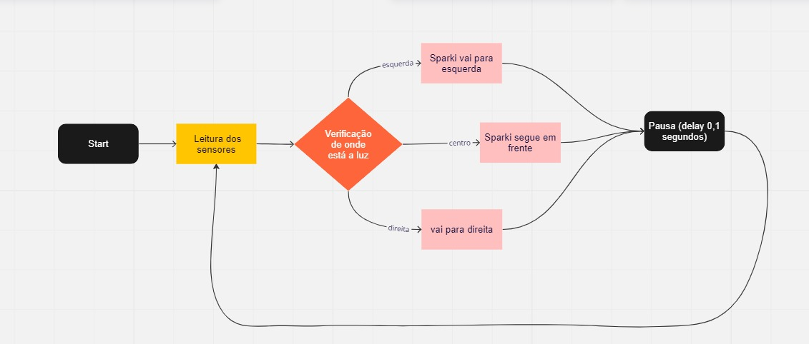

# Projeto 3 - Seguir Luz  <h1>

Este código é uma demonstração de como o Sparki utiliza os sensores de luz esquerdo, central e direito para tomar decisões de movimento com base na intensidade da luz detectada. Essas decisões permitem que o Sparki navegue pelo ambiente de forma mais eficiente. 
Para melhorar a precisão das medições, o projeto foi conduzido em uma sala escura, onde a influência de outras fontes de luz foi minimizada. O Sparki é capaz de determinar a direção correta com base na intensidade da luz em cada sensor e realizar os movimentos apropriados, 
como avançar, virar para a esquerda ou virar para a direita.

No loop contínuo do programa, o Sparki realiza as seguintes ações:

  1. Mede a intensidade da luz no sensor de luz esquerdo, no sensor de luz central e no sensor de luz direito.     
  2. Verifica as condições para determinar a direção de movimento com base na intensidade da luz detectada.      
  3. Se a intensidade da luz central for a mais forte entre as três, o Sparki conclui que está seguindo na direção correta e continua se movendo para frente.      
  4. Se a intensidade da luz esquerda for a mais forte, o Sparki determina que está desviando para a esquerda e realiza um movimento de rotação para a esquerda.     
  5. Da mesma forma, se a intensidade da luz direita for a mais forte, o Sparki conclui que está desviando para a direita e realiza um movimento de rotação para a direita.      
  6. Após cada iteração do loop, há um pequeno atraso de 0,1 segundos (100 milissegundos) antes do próximo ciclo.      
  

## Link do vídeo yotube: 
[Vídeo do robô executando código](https://youtu.be/eeBp4ox2Pj8)  

  ## Fluxograma 
  
Essa documentação descreve o fluxograma do programa Sparki passo a passo. 
  

